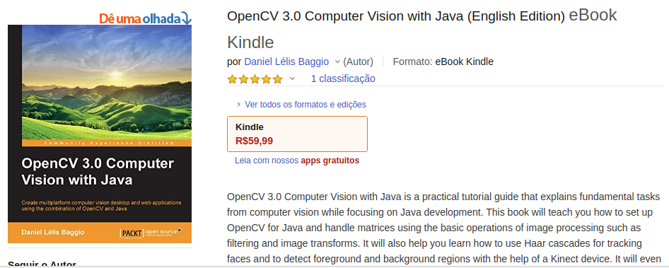
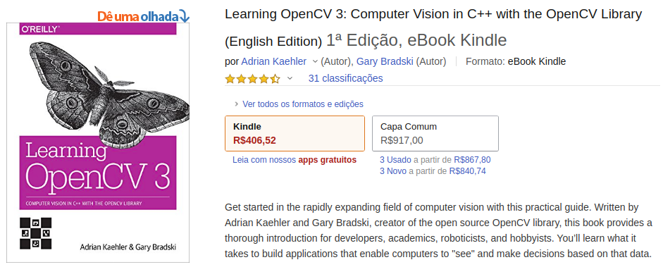
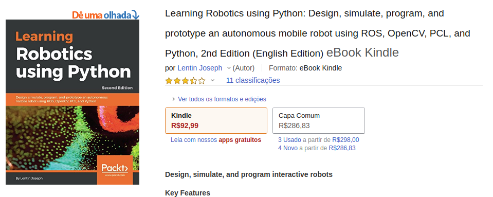
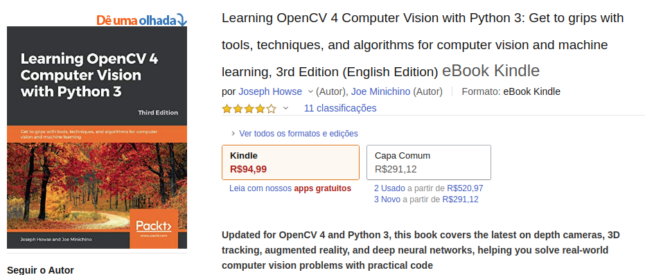
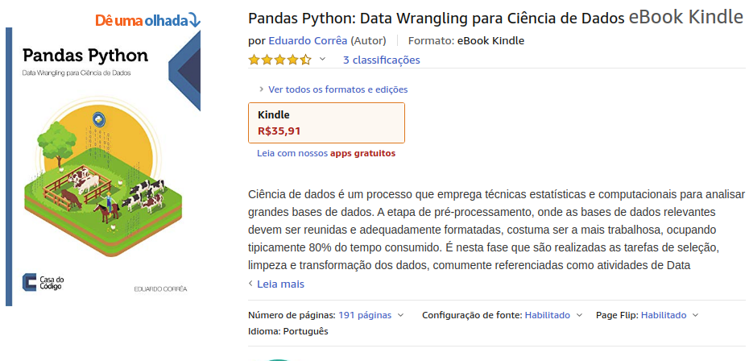
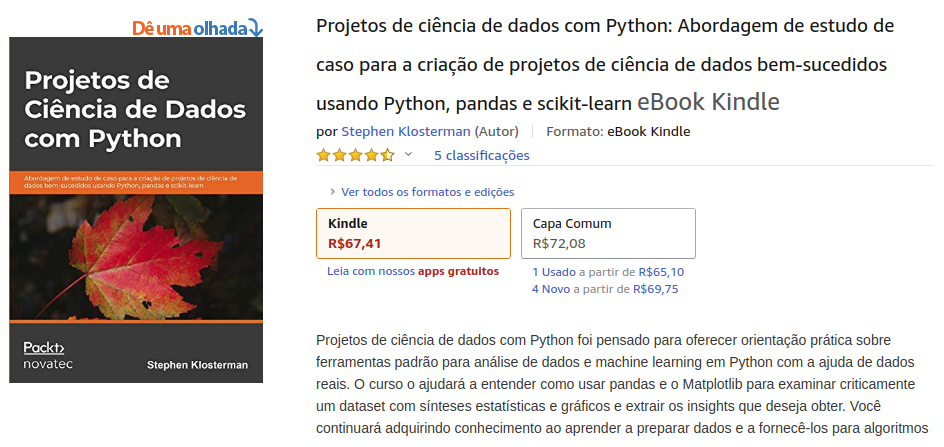
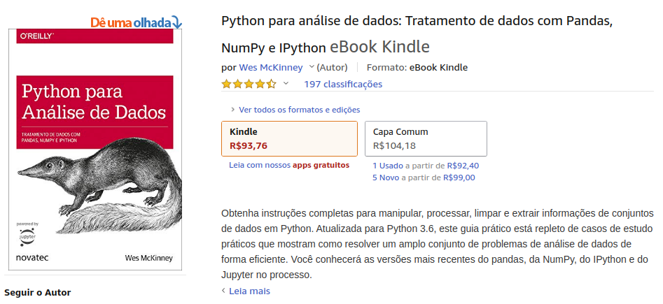
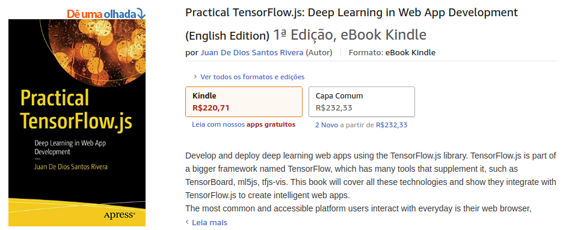
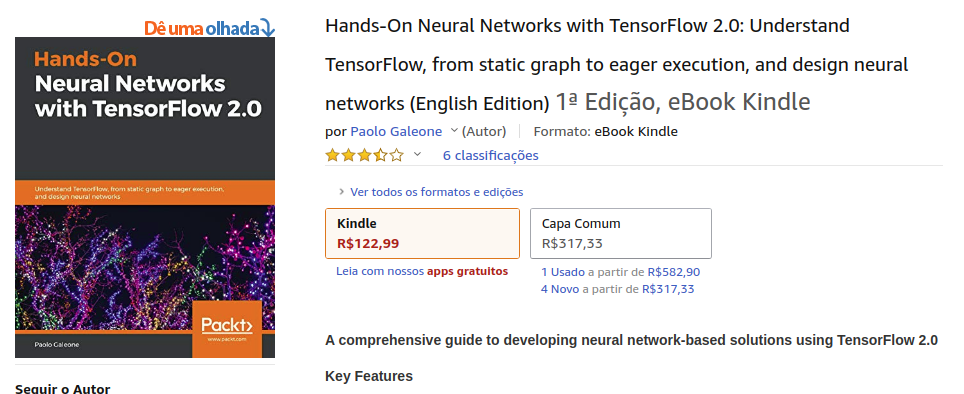
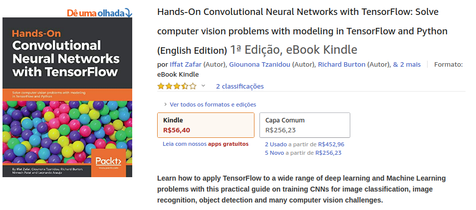

# Livros que foram lidos e vistos (leituras quase finalizadas) no ano 2019

Meu ano 2019 foi bastante rico de leituras técnicas, naquele ano aprendi muito sobre Inteligência Artificial estando ciente que ainda falta muito por aprender, e para registrar aquela época de leituras deixo por aqui uma lista comentada sobre os livros e textos que aproveitei naquela época.

